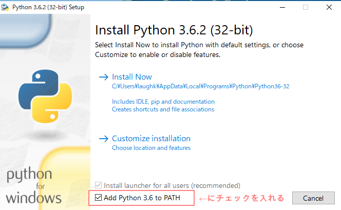

# 0.事前準備

## 目的

* Python入門者向けハンズオン参加者に、事前にやってもらうことが書いてあります
* 事前準備をしないとハンズオンに参加登録できません

## Pythonをインストール

* Python 3.6.2 をダウンロードしてインストールしてください

  * https://www.python.org/downloads/

* Windowsの人はPATHの設定を行ってください。

  * Intall の際に「Add Python 3.6 to PATH」にチェックを入れると自動的に設定されます。

    

  * 上記チェックをいれずにインストールした場合は以下のリンクを参考に設定を行って下さい。

    * http://www.pythonweb.jp/install/setup/index1.html

* **condaを使っている人**

  * condaを使用すると、ハンズオンの途中(仮想環境について)で講師がサポートできない内容が出てきます
  * 自己解決できない場合は、上記のPythonをインストールしてください

## エディタを準備

* プログラムを書くためのエディタを準備してください
* 普段使っているエディタがある人はそのエディタを使ってください。なお、utf-8で保存できる必要があります
* 普段エディタを使っていない人は Atom というエディタがおすすめなので、インストールしておいてください

  * [Atom](https://atom.io/ "Atom")
  * メニューを日本語化したい人はこちらもあわせてどうぞ
  * [Atomでパッケージをインストールする方法とメニューの日本語化 – nocorica](http://blog.nocorica.jp/2015/03/atom-package-install/ "Atomでパッケージをインストールする方法とメニューの日本語化 – nocorica")

* 他に以下のIDEもおすすめです

  * [PyCharm](https://www.jetbrains.com/pycharm/download/ "PyCharm :: Download Latest Version of PyCharm")(Community版は無料です)

## connpass参加登録

* 上記の事前準備(Python, エディタ)完了後に connpass から参加登録してください
* 参加登録時にPythonバージョン、エディタの名前や習熟度を確認します

  * 回答内容が適切でない場合は参加をこちらからキャンセルする場合があります
