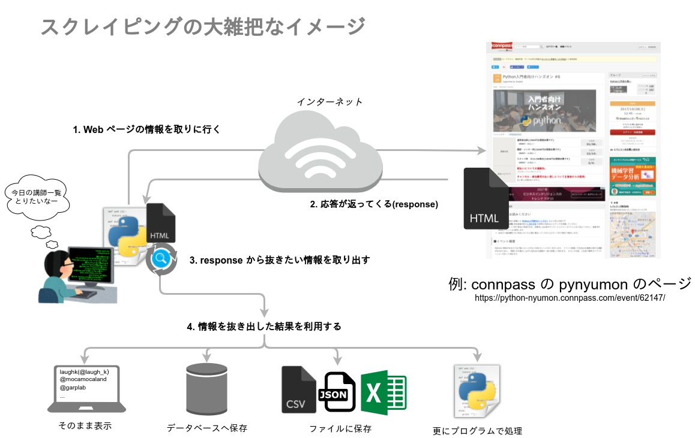

# 2.スクレイピング

スクレイピングとは Web サイトから自分のほしい情報を取り出して収集する技術のことをいいます。  
おおまかな処理の流れとしては以下のイメージです。



Python で簡単にスクレイピングを行う際には以下のサードパーティー製のライブラリを使うと便利です。

処理 | ライブラリ | ドキュメント
-|-|-
Web ページから情報を取得 (図の1,2) | Requests | [Requests: HTTP for Humans](http://docs.python-requests.org/en/master/)
response からほしい情報を取り出す (図の3) | Beautiful Soup 4 | [Beautiful Soup Documentation](https://www.crummy.com/software/BeautifulSoup/bs4/doc/)

## requests - Webからデータを取得する

PythonでWebへのアクセスをする時に最も手軽な方法は `requests` を使う方法です。pipでインストールできます。
GETとPOSTはrequests.getとrequests.postを使えば大体事足ります。

インストール

```sh
$ pip install requests
```

詳しくはこちらを参照してください。
http://requests-docs-ja.readthedocs.org/en/latest/

## BeautifulSoup4 - HTMLを解析する

HTMLを解析するにはBeautifulSoup4を使うと良いでしょう。

```py
>>> from bs4 import BeautifulSoup
>>> soup = BeautifulSoup('<div><h1 id="test">TEST</h1></div>', 'html')
>>> soup.select_one('div h1#test').text
'TEST'
```

タグ内の文字は`soup.text`で、属性には`soup['id']` (idのところは属性名)でアクセスできます。

BeautifulSoup objectのよく使うmethod

- BeautifulSoup.find() -> タグを検索して最初にhitしたタグを返す
- BeautifulSoup.find_all() -> タグを検索してhitしたタグのリストを返す
- BeautifulSoup.find_previous() -> 一つ前のタグを返す
- BeautifulSoup.find_next() -> 一つ後ろのタグを返す
- BeautifulSoup.find_parent() -> 親タグを返す
- BeautifulSoup.select() -> css selectorでタグのリストを返す
- BeautifulSoup.select_one() -> css selectorで検索して最初にhitしたタグを返す


詳しくはこちらを参照してください。
https://www.crummy.com/software/BeautifulSoup/bs4/doc/

## データの永続化

### CSV形式

CSVはカンマで区切られた形式のファイルです。csvモジュールが使えます。
csv モジュールのさらに詳しい内容についてはこちらを参照してください。
http://docs.python.jp/3/library/csv.html

#### 書き込み

```py
import csv
with open('some.csv', 'wb') as f:
    writer = csv.writer(f)
    writer.writerows(someiterable)
```

#### 読み取り

```py
import csv
with open('some.csv', 'rb') as f:
    reader = csv.reader(f)
    for row in reader:
        print row
```

### JSON形式

JSON形式もよく使われる形式です。標準モジュールの `json` モジュールを使用します。

```py
>>> import json
>>> json.dumps([1, 2, 3, 4])
'[1, 2, 3, 4]'
>>> json.loads('[1, 2, 3, 4]')
[1, 2, 3, 4]
>>> json.dumps({'aho': 1, 'ajo': 2})
'{"aho": 1, "aro": 2}'
>>> json.loads('{"aho": 1, "ajo": 2}')
{u'aho': 1, u'aro': 2}
```

- json.dumps() -> オブジェクトをJSON文字列にする
- json.loads() -> JSON文字列をオブジェクトにする
- json.dump() -> オブジェクトをJSON文字列にしてそれをファイルに書き込む
- json.load() -> ファイル内のJSON文字列を読み込んでオブジェクトにする

詳しい内容についてはこちらを参照してください。
http://docs.python.jp/3/library/json.html

## サンプル

スクレイピングのサンプルとしていくつか準備しています。参考にしてください。ただし一般のサイトもあるのでリクエストをバンバン投げることはやめてください。
間違ってもループをそのまま回したらダメですよ。

- PyConJPからチュートリアルの情報を抜き取る https://github.com/TakesxiSximada/happy-scraping/tree/master/pycon.jp
- PyPIから新着パッケージの情報を抜き取る  https://github.com/TakesxiSximada/happy-scraping/tree/master/pypi.python.org
- DjangoのAdminサイトの認証を突破する https://github.com/TakesxiSximada/happy-scraping/tree/master/djangoadmin
- User-Agent詐称 https://github.com/TakesxiSximada/happy-scraping/tree/master/fake-useragent
- Javascriptで動的に生成されるデータを抜き取る https://github.com/TakesxiSximada/happy-scraping/tree/master/dynamic-page

## データ取ってみたら面白そうなサイト

- https://teratail.com/ トップページのエントリとか刈り取ってみるとよいかも
- http://isitchristmas.com/ クリスマス判定 (時期的に)
- https://data.nasa.gov/developer NASAのデータが利用できるので調べてみると面白いものがあるかもしれない

他にも良さそうなサイトはいっぱいありそう...
